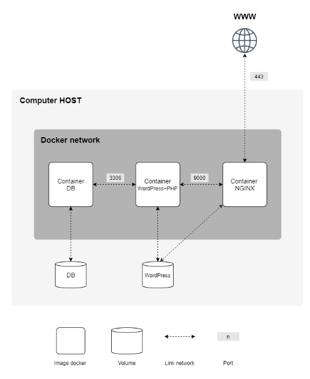

# Inception
This project was developed for 42 school. For comprehensive information regarding the requirements, please consult the PDF file in the subject folder of the repository. Furthermore, I have provided my notes and a concise summary below.
``` diff
+ keywords: docker
+ set up small infrastructure composed of different services
+ docker virtualises the operating system, lightweight (only one kernel) and portable containers
+ move from monolith apps to a service oriented architecture
+ development - testing - production
```

_Mindmap (shinckel, 2024)_


## High-level Overview

Each Docker image must have the same name as its corresponding service. Each service has to run in a dedicated container.
For performance matters, the containers must be built either from the penultimate stable version of Alpine or Debian. The Dockerfiles must be called in your docker-compose.yml by your Makefile.
Write your own Dockerfiles, one per service.

You then have to set up:
• A Docker container that contains NGINX with TLSv1.2 or TLSv1.3 only.
• A Docker container that contains WordPress + php-fpm (it must be installed and
configured) only without nginx.
• A Docker container that contains MariaDB only without nginx.
• A volume that contains your WordPress database.
• A second volume that contains your WordPress website files.
• A docker-network that establishes the connection between your containers.
Your containers have to restart in case of a crash.

```
-| srcs/
---| docker-compose
---| requirements/
----| mariadb/ (database)
-----| Dockerfile
----| nginx/ (web server)
-----| conf/
-----| Dockerfile
----| wordpress
-----| conf
-----| tools
-----| Dockerfile
| Makefile
```

### Relationship Between MariaDB, Nginx, and WordPress
- MariaDB: This container runs the MariaDB database server, which stores all the data for your WordPress site.
- Nginx: This container runs the Nginx web server, which serves as a reverse proxy to forward HTTPS requests to the WordPress container.
- WordPress: This container runs WordPress with PHP-FPM, which processes PHP code and generates dynamic content for the website.
-All services run in separate containers, connected via a Docker network, with volumes for persistent storage. The docker-compose.yml and Makefile automate the setup and management of these containers.



Using network: host or --link or links: is forbidden.
The network line must be present in your docker-compose.yml file.
Your containers musn’t be started with a command running an infinite
loop. Thus, this also applies to any command used as entrypoint, or
used in entrypoint scripts. The following are a few prohibited hacky
patches: tail -f, bash, sleep infinity, while true.

```
- apt-get install docker-engine (debian/ubuntu)
- docker toolbox (download to mac, creates a VM for running docker)

- docker info (how many images)
- docker version
- docker run (if doesn't have an image locally, it talks to dockerHub remotelly)
- time docker run hello-world (how much time takes to run the container in ms)
- docker run -d -P [image-name] (locally or remotely, - flags tell how to run the container, P is for mapping a random port on the host to a specified port within the container itself)

- docker ps (you should see the container running)
- access and visualize the deployed application through [ip number]/port

- docker build -t name/demo:v1 . (build and name the image, add a tag e.g. v1)
- docker run -d -P name/demo:v1 (run a container)

- docker build -t name/demo:v2 . (edit the source file and build another image, changing the version tag. it will use the cache and build super fast)
- docker images

- share container with friends in dockerHub -> docker push name/demo:v2

- docker logs image-name
- docker rm image-name
- docker ps -a (list all containers, including the ones that have stopped)
- docker stop container-name
- docker network ls (list current docker network)
- driver: network type

# A basic Apache+PHP Image 
FROM ubuntu:12.04

MAINTAINER Nicola Kabar version: 0.1

RUN apt-get update && apt-get install -y apache2

RUN apt-get install -y php5

ENV APACHE_RUN_USER www-data
ENV APACHE_RUN_GROUP www-data
ENV APACHE_LOG_DIR /var/log/apache2

RUN rm -rf /var/www/*
ADD index.php /var/www/

EXPOSE 80

CMD ["/usr/sbin/apache2", "-D", "FOREGROUND"]
```

```
$ docker pull centos
$ docker run -d -t --name myfirstcontainer centos
$ docker ps
> CONTAINER ID   IMAGE     COMMAND       CREATED         STATUS         PORTS     NAMES
> abd188b5d3a4   centos    "/bin/bash"   3 seconds ago   Up 2 seconds             myfirstcontainer
$ docker exec -it myfirstcontainer bash
[root@abd188b5d3a4 /]# --> you are inside the container, connected to bash shell

$ docker pull alpine
$ docker run -d -t --name mysecondcontainer alpine
$ docker exec -it mysecondcontainer sh
> / #
> exit

$ docker run -itd --rm --name thor busybox (rm remove container after running it)
> CONTAINER ID   IMAGE     COMMAND                  CREATED          STATUS          PORTS     NAMES
> a3e817b291a6   nginx     "/docker-entrypoint.…"   20 seconds ago   Up 19 seconds   80/tcp    spiderman
> 1b41d844c330   busybox   "sh"                     10 minutes ago   Up 10 minutes             batman
> 6b75aab91b64   busybox   "sh"                     10 minutes ago   Up 10 minutes             thor
$ ip address show (it will show three new networks, besides loopback, broadcast and docker)
$ bridge link
> 29: vethd80e00e@if28: <BROADCAST,MULTICAST,UP,LOWER_UP> mtu 1500 master docker0 state forwarding priority 32 cost 2 
> 31: vethb13694d@if30: <BROADCAST,MULTICAST,UP,LOWER_UP> mtu 1500 master docker0 state forwarding priority 32 cost 2 
> 33: vethc69260d@if32: <BROADCAST,MULTICAST,UP,LOWER_UP> mtu 1500 master docker0 state forwarding priority 32 cost 2
$ docker inspect bridge
$ docker run -itd --rm -p 80:80 --name spiderman nginx
$ docker ps
> CONTAINER ID   IMAGE     COMMAND                  CREATED          STATUS          PORTS                               NAMES
> f7cdd36128cf   nginx     "/docker-entrypoint.…"   2 minutes ago    Up 2 minutes    0.0.0.0:80->80/tcp, :::80->80/tcp   spiderman
```

### References:
[Virtual Machine (VM) vs Docker](https://www.youtube.com/watch?v=a1M_thDTqmU)<br />
[What are Microservices?](https://www.youtube.com/watch?v=CdBtNQZH8a4)<br />
[Containerization Explained](https://www.youtube.com/watch?v=0qotVMX-J5s)<br />
[Contain Yourself: An Intro to Docker and Containers by Nicola Kabar and Mano Marks](https://www.youtube.com/watch?v=arRDKrVGw7k&t=833s)<br />
[What is Docker?](https://docs.docker.com/get-started/docker-overview/) *watch demo from minute 24*<br />
[Apache+PHP Dockerfile Demo](https://github.com/nicolaka/demo_cs50)<br />

## Concepts

| Task | Prototype | Description |
|:----|:-----:|:--------:|
| **VM && docker** | `abstraction layer`| Software is used to create an abstraction layer(virtualization). VM lifecycle is measured in months. Container lifecycle is measured in seconds. |
| **Virtual machine** | `Hypervisor` | Virtual machine emulates the physical computer, managing the allocation of resources (virtual hardware, virtual CPU, guest OS, etc) from a single physical host. **Benefits:** diverse OS, isolation/separated kernel and OS, set environment for running legacy applications. **Downsides:** deploy a separated guest OS everytime you create a VM, binary library, etc, even for a small application. It takes a lot of resources. **host OS - hypervisor - guest OS** |
| **Containerization** | `Operating System virtualization` | Instead of hardware level, it is an OS virtualization abstraction level. Each application lightweight, isolated, runnable, and portable. New way to package *EVERYTHING* that an app needs to run, regardless of running it in a local or production environment (a.k.a no matter which underlying infrastructure). Example: if you developed your app locally, using the Docker platform, expect it to be successfully deployed. No matter what is the underlying infrastructure. As long as there is a docker engine running on the other side (operation infrastructure using any cloud: AWS, Google, Microsoft, open stack cloud) your application is going to be successfylly deployed there. Running with the exact same behaviour you architectured it to be. Watch [Why You Need to Learn Containerization](https://www.youtube.com/watch?v=k58COAYTBCM). |
| **Docker** | `Containerization` `built around client server architecture` | Open source platform that uses containerization. Package of application and dependencies into lightweight containers. An individual container has only the application and its libraries and dependencies. **Benefits:** Microservices, speed development/deployment/scale up, CI/CD pipelines, resource efficiency/small footprint. **host OS - runtime engine - don't worry about guest OS - container/libs**. Shared resources: if it is not being used by the service, share resources with the other containers.  |
| **Docker engine** | `orchestrating containers` | Creating, running and orchestrating containers (building - shipping - deploying - managing). Interact with host kernel to allocate resources and force isolation between containers. **Control groups, namespaces**: restrict access and visibility to others. It is built around HTTP REST API. |
| **Docker image** | `executable packages` | Runtime code/libraries/tools/lightweight standalone, static files. Executable packages, which are built using **Dockerfile**. *TEMPLATE* in which containers are built from. *READ-ONLY, IMMUTABLE.* |
| **Docker container** | `isolated environment` | Instances of the docker images, running in the docker engine. Isolated in a self-sufficient environment. *READ-WRITE LAYER.* Copy-on-write(COW): if you are not making extra changes in the container, it is not going to take extra space, so it is utilizing what is already there. |
| **Chicken and egg**| `references` | All containers are born from images and images are created from commited containers. Dockerfile can be understood as the first step of the process, automated by Docker itself. |
| **Dockerfile** | `manifest` | Instructions for building the images. A manifest describes de container, in docker world it would be the Dockerfile (but please remember that containerization concept was created in 2008 before docker existed - released in 2013). **manifest - image - container => for every line it creates de container - executes that line - commits container to a new image - uses it for all subsequent operations**  |
| **Microservices** | `modular application architecture` | Every app function is its own service running in a container. Services communicate via API, in a modular and more flexible way: you can use different languages/frameworks, deploy it fast, if one service fails/crash the rest continue to run in an independent way. It is also possible to add capability to a specific service that is more required e.g. payment service for a webside selling ticket to the final game. |
| **Monolith** | `rigid application architecture` | You are dependent on decisions made in the past(language/framework, libraries). Over time it is difficult to grow: what are the dependencies and relationship between the different parts of the software? For deploying it you will have to shut down the app and deploy everything again (sometimes a second instance of the whole application), it takes a long time. **SHIFTED FROM DEPLOYING EVERY MONTH TO CONTINUOS INTEGRATION AND CONTINUOS DEVELOPMENT.** |
| **bare metal** | `bare machine` | Refers to a computer executing instructions directly on logic hardware without an intervening operating system. |
| **REST API** | | |
| **Check docker in your VM** | `docker run -it ubuntu bash` | The purpose of this command is to start a new Ubuntu container and provide you with an interactive Bash shell inside that container. |
| **Network** | `80:80 host:dockercontainer` | Container share the same configs as the host e.g. ip address, or port forwarding e.g. into the host OS stack, meaning: host port 8888 inside the app could be running in port 80. |
| **Bridge network** | `Default bridge` `docker 0 : virtual bridge interface` | Each app has its own ip address (and could share with other containers) `ip address show`. Change network from NAT to Bridge Adapter. Downside: manually expose ports, otherwise you can't access services directly e.g. website. `docker run -itd --rm -p 80:80 --name spiderman nginx`. Each container has its own ip address. Each one has a copy of `/etc/resolv.conf`. |
| **Volumes** | | Each app has its own filesystem, but you can map files from host directly to your app (keep data, destroy containers). E.g. shared container volumes, doesn't run app only share data. |
| **Clean cache** | `sudo apt-get clean` `sudo du -sh /* pipe sort -h` | |
| **User defined bridge** | `docker network create name` | `docker network ls` `ip address show` `hostname -I` will show a new network bridge. `docker run -itd --rm --network [network name] --name [container name] [image name]` `bridge link` `docker inspect [network name]` new interfaces will be tied to the virtual bridge created. Why should I do it? **ISOLATION**, protected from the default network. Check using `ping`, I can ping the new virtual bridge by name `ping [network name]`. |
| **Host network** | `docker run -itd --rm --network host --name [container name] [image name]` | Moved next to the host, everything is shared with the host e.g. ip address, ports, etc. Downside: no isolation. |
| **Mac VLAN** | | |
| **Remove cache** | `sudo apt-get clean` | Remove the package cache to free up space. Remove unused Docker containers, volumes, and networks to free up space `docker container prune -f` `docker volume prune -f` `docker network prune -f`. Check for large log files and remove them `sudo rm -rf /var/log/*.log` |
| **Verify port mapping** | `sudo netstat -tuln [pipe] grep 80` | `tcp 0 0 0.0.0.0:80 0.0.0 0:* LISTEN` |
| **Check if services are network connected** | `docker network inspect my_custom_network` | It will return an object containing connected services. |
| **Useful commands** | `troubleshooting` | `docker-compose -p srcs restart nginx` `docker-compose -p srcs ps` `docker-compose -p srcs logs wordpress` `docker exec -it inception-nginx apt-get install -y telnet` `docker exec -it inception-nginx telnet wordpress 9000` `sudo systemctl status docker` |

Ensure the directories have the correct permissions so that Docker can access them:
sudo chown -R ubuntu:ubuntu /home/ubuntu/data/wp_data
sudo chown -R ubuntu:ubuntu /home/ubuntu/data/db_data
sudo chmod -R 755 /home/ubuntu/data/wp_data
sudo chmod -R 755 /home/ubuntu/data/db_data

docker inspect 4dad940eafe4 | grep -i env
